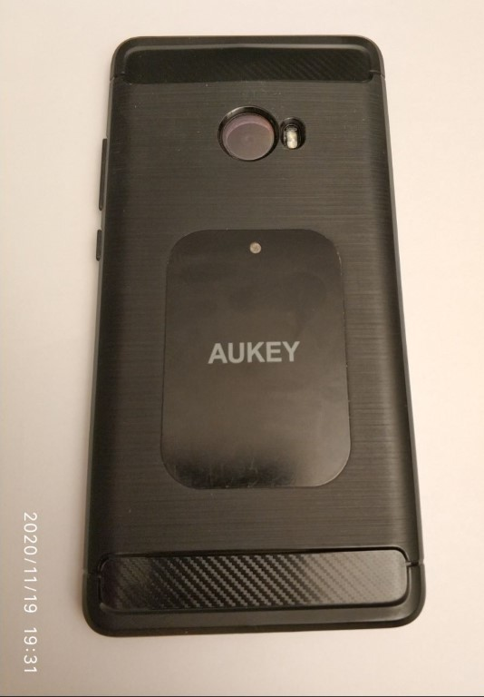
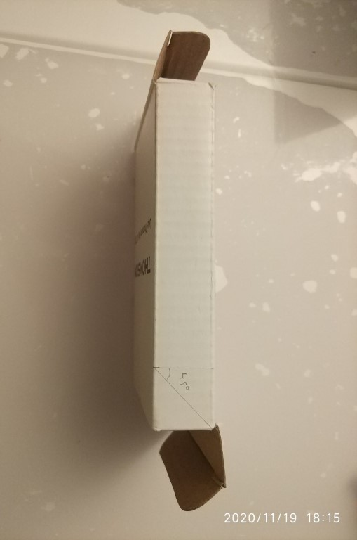

[TOC]

# Mini-projet Optique :mag_right:

> Les sources de lumière sont caractérisées par la courbe de répartition spectrale de l’intensité I (courbe f (fréquence) ou sigma (nombre d’onde) -> I (f) ou I(sigma)). Quelles sont les méthodes expérimentales qui permettent d’accéder à cette répartition? Vous présenterez différentes méthodes envisageables suivant la source de lumière et la précision que l’on souhaite avoir sur la courbe de répartition spectrale.

## Analyse des termes de l'énoncé ​

**Sources de lumière** : Ici, on considérera une source lumineuse dans le *spectre du visible* (400-800 nm) :rainbow: .

**Courbe de répartition spectrale** : Aussi appelée *décomposition spectrale*, *profil spectral* ou plus simplement *spectre*, elle correspond à la *courbe représentant l'intensité lumineuse I des radiations en fonction des longueurs d'onde* $\lambda$ , autrement dit $\lambda\mapsto I$ ou bien $f\mapsto I$ . :chart_with_upwards_trend:

Pour rappel :

- $\sigma=\frac{1}{\lambda}$ 	autrement dit, le nombre d'onde (en m^-1^) est l'inverse de la longueur d'onde.
- $\lambda=\frac{c}{f}$ 	avec $c$ la célérité ou vitesse de propagation de l'onde dans le milieu qu'elle traverse.

## Mise en contexte et reformulation

On cherche donc une méthode expérimentale pour obtenir le profil spectral d'une source lumineuse.

La **spectrométrie** est définie[^1] comme étant la mesure de grandeurs physiques associées à un spectre.

Ainsi, l'appareil destiné à la mesure de la répartition d'un rayonnement complexe en fonction de la longueur d'onde est un **spectromètre**[^2].

Il faut donc bien distinguer le domaine de la spectrométrie qui nous concerne ici, des études de spectres d'absorption comme la *spectrophotométrie d'absorption*, de la *spectroscopie* (analyse des corps par l'examen de leur spectre d'absorption ou d'émission[^3]) ou encore la *spectrocolorimétrie* qui concerne les caractéristiques chromatiques de radiations spectrales.

[^1]: https://www.cnrtl.fr/definition/spectrometre
[^2]: https://www.larousse.fr/encyclopedie/divers/spectrometre/93302
[^3]: https://www.cnrtl.fr/definition/spectroscopie

## Différentes approches théoriques

Pour parvenir à une courbe de répartition spectrale d'une source lumineuse, on peut distinguer deux familles de spectrométrie : la **spectrométrie de dispersion** et la **spectrométrie de Fourier**.

1. La **spectrométrie de dispersion** regroupe toutes les [méthodes](###Montages basés sur la spectrométrie dispersive) expérimentales qui consistent à disperser la lumière, généralement via un *prisme* ou un *réseau de diffraction*.

   |  |  |
   | :----------------------------------------------------------: | :----------------------------------: |
   | [Prisme](https://www.youtube.com/watch?v=HW-lXjOyUWo&list=PL3PhWT10BW3Urh8ZXXpuU9h526ChwgWKy) |        Réseau de diffraction         |

2.  La **spectrométrie de Fourier** appartient aux techniques de Spectroscopie par Transformée de Fourier (STF). 

   Comme son nom l’indique, elle exploite le concept d’espace de Fourier. Si conceptuellement elle est moins intuitive, elle offre deux avantages importants comparativement aux méthodes dispersives : l’avantage de Fellgett[^4] et de Jacquinot[^5]. Ceux-ci permettent de mesurer rapidement des spectres avec une excellente résolution et un bon rapport signal sur bruit. 

   La spectroscopie par transformée de Fourier est la technique de choix pour mesurer un spectre infrarouge, de l’infrarouge lointain (100 cm^−1^ ) jusqu’à environ 10 000 cm^−1^. C’est pourquoi l’acronyme anglais [FTIR](####Interféromètre de Michelson (FTIR)) est souvent utilisé pour se référer à cette technique. 

   Le principe de mesure ne restreint pas l’application de la STF à l’infrarouge, mais ses avantages comparativement aux méthodes dispersives, comme les spectromètres à réseau, sont moins évidents à des longueurs d’onde de moins de λ = 1 µm . 

3. En réalité, il existe aussi une 3^ème^ famille qui est la **spectrométrie par filtrage**. Cependant elle n'est plus utilisée pour de l'analyse spectrale de la lumière à ma connaissance.

   

[^4]: Aussi appelé avantage multiplexe, il provient du fait que l'information concernant toutes les longueurs d'onde est recueillie simultanément. Ceci résulte en un plus haut rapport signal sur bruit pour un temps de balayage donné, ou un temps de balayage plus court pour une résolution donnée. https://hal.archives-ouvertes.fr/jpa-00235799/document
[^5]: Aussi appelé avantage d’étendue, il traduit le fait que, dans un interféromètre de Michelson, l’étendue géométrique de la source peut être augmentée sans brouiller les franges ([Jacquinot, 1958](https://pdfs.semanticscholar.org/6cfe/2a03d4b07bf2d7e6c4d746df0cbea4465adf.pdf?_ga=2.74420626.1816207263.1605027880-1567918850.1605027880)). Mais cet avantage n’est pas attaché à la spectroscopie par transformée de Fourier en général, et dépend du dispositif expérimental utilisé. Un spectromètre par transformée de Fourier avec un interféromètre de Michelson possède cet avantage, tout comme un interféromètre de Fabry-Pérot, mais pas un spectromètre par transformée de Fourier statique en franges de coin d’air.

## Montages pratiques

Cette section présente les **3 différents montages** envisageables pour un **spectromètre**.

### Montages basés sur la [spectrométrie dispersive](##Différentes approches théoriques)

Parmi les montages d'analyse dispersive, on peut distinguer les méthodes dites "monochromatiques" qui étudient chaque longueurs d'ondes individuellement, des méthodes "directes" qui analysent toutes les longueurs d'ondes dispersées en même temps grâce à des capteurs de type CCD ou plus rarement CMOS.

#### Spectromètre à prisme

Schéma simplifié : 

Montage pratique :

On considère une **source lumineuse polychromatique** émettant à travers un **collimateur**, qui a pour but de former un *faisceau parallèle* à partir de la **fente** éclairée.

Ces rayons lumineux parallèles passent au travers d'un **prisme**.  Le prisme a pour particularité de *disperser la lumière*. En effet, chaque longueur d'onde entrant dans le prisme sort avec un angle différent. 

La **lunette de visée** peut être ici remplacée par un **capteur** (photodiode ou CCD) mesurant l'*intensité lumineuse*. La détermination des *longueurs d'ondes mesurées* est possible en montant tous ces éléments sur un **goniomètre** (de gônia « angle » et metron « mesure, évaluation ») servant à effectuer des *mesures d’angles*.

##### Pouvoir de résolution :framed_picture:

Le terme précision n'est pas rigoureux et correspond en fait au **pouvoir de résolution (ou résolvance)** définit comme :

> La capacité à résoudre* deux raies d’un même spectre. Il est limité par le phénomène de diffraction.
>
> $R=\frac{\lambda}{\Delta\lambda}=\frac{\sigma}{\Delta\sigma}$ , avec $\Delta\lambda, \Delta\sigma$ : la plus petite séparation discernable

Cette équation est valide peu importe le système d'unité.

Pour un prisme de taille respectable (*e= 10 cm*), le **pouvoir de résolution est de 10^4^**.

*Deux raies à la **limite de la résolution théorique** selon le critère de Rayleigh [^6]:

[^6]: https://www.polymtl.ca/phys/lsmn/phs3210/c2.pdf

#### Spectromètre à réseau de diffraction

Il existe deux types de réseau de diffraction : les réseaux à réflexion et les réseaux à transmission (ce dernier est moins performant mais aussi moins couteux). Ainsi les spectromètres commerciaux n'utilisent que des réseaux à réflexion. C'est le procédé le plus précis dans le domaine du visible, de plus il est relativement simple à mettre en œuvre (cf. expérimentation) et solide.

Le principe de fonctionnement[^7] est décrit dans l'animation qui suit :

La l**umière polychromatique** à analyser (ici collectée par une fibre optique) est introduite dans le spectromètre au travers d’une **fente**.  

Le faisceau est réfléchi vers le **réseau en réflexion** par un **miroir courbe de collimation** (pour obtenir un  faisceau  quasi-parallèle  et ainsi avoir un angle d’incidence constant sur toute la surface du réseau). 

Le  faisceau  issu  du  réseau  dont  les  couleurs  sont  maintenant  « dispersées »  est renvoyé par un **second miroir courbe de focalisation** sur le **capteur d’image** dont  chacun  des pixels  de  sa  « mosaïque »  recevra  la  lumière  d’un  élément spectral Δλ distinct et élaborera une réponse numérique. Le capteur inclut souvent un système de lentille optimisant ainsi la collecte du flux sur les pixels.

On peux utiliser une  **« barrette »  CCD**  composée  d’une  « mosaïque » de 2048 pixels alignés. 

[^7]: source : http://mpsn.free.fr/opt3/c_td/S3_ch5_reseaux_14.pdf

### Montages basés sur la [spectrométrie de Fourier](##Différentes approches théoriques)

#### Interféromètre de Michelson (FTIR) :microscope:

Animation[^8] :

Schéma :

La mesure de l’intensité d’un point donné sur le détecteur en fonction de la différence de marche porte le nom d’interférogramme f(Δ=2dcos(θ)). Celui-ci est directement relié au spectre de la source f(σ) par une transformée de Fourier. :computer:

##### Pouvoir de résolution dans le visible

Le rapport signal sur bruit limite la STF dans le visible, malgré une excellente résolution spectrale. Dans le visible, les spectromètres à réseaux offrent un rapport signal sur bruit plus favorable.

[^8]: source : https://media4.obspm.fr/public/ressources_lu/pages_fourier/impression.html

#### Interféromètre de Fabry-Pérot

Schéma[^9] :

Montage pratique[^10] :

Figure d'interférence observable pour une source polychromatique :

La bande de fréquence sur laquelle le spectre optique obtenu peut être analysé (Intervalle Spectral Libre, ISL) sans ambigüité est beaucoup plus mince que pour un interféromètre à diffraction d'où son utilisation généralement cantonnée à l'astronomie.

[^9]: source : http://hyperphysics.phy-astr.gsu.edu/hbase/phyopt/fabry.html
[^10]: source + informations complémentaires : http://www.optique-ingenieur.org/en/courses/OPI_ang_M02_C05/co/Contenu_33.html

## Montage Expérimental

### Schéma 

### Images d'illustration

|        Étapes        |                                                              |                        Illustrations                         |                                                              |
| :------------------: | :----------------------------------------------------------: | :----------------------------------------------------------: | :----------------------------------------------------------: |
|     Découpe DVD      |  |  |  |
| Mise en place réseau |  |  |                                                              |
| Découpe boîte finale |  |  |  |
|                      |  |  |  |

### Vidéo de la prise de photos pour différentes sources lumineuses :camera_flash:

<iframe width="315" height="560" src="https://www.youtube-nocookie.com/embed/zatkKv_Dmtg" frameborder="0" allow="accelerometer; autoplay; clipboard-write; encrypted-media; gyroscope; picture-in-picture" allowfullscreen></iframe>

### Exploitation des photos de spectres

#### Lampe Fluo-compacte

On observe assez nettement les pics d'intensités caractéristiques des lampes fluorescentes.

Pour le traitement d'image les opérations suivantes ont été nécessaires : 

#### Lampe halogène :bulb:

On remarque un spectre qui couvre une large plage de longueurs d'ondes, avec une intensité croissante, ainsi le bleu est à peine visible, mais le rouge très présent.

#### LED

La répartition spectrale confirme qu'il s'agit d'une LED de couleur chaude comme on peut le voir dans la [vidéo](###Vidéo de la prise de photos pour différentes sources lumineuses).

---------

Version : 22/11/2020

© Loïc Boyer